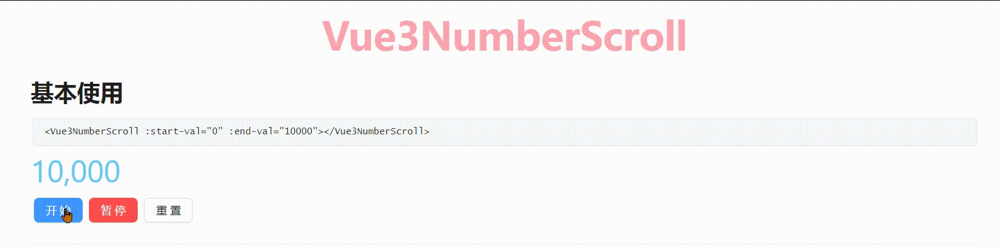

## vue3-number-scroll使用指南

​	**该组件用于创建具有动画效果的数字显示，可以配置起始值、结束值、动画持续时间等属性。**
​	**它是基于 vue-count-to 升级改造,由于  [vue-count-to](https://panjiachen.github.io/countTo "原仓库地址") 不支持vue3,以及长时间没有更新的原因,我在项目中的大屏项目需要使用,所以顺便升级维护一下。**



**描述**


| 新特性                                                              | 支持               |
| ------------------------------------------------------------------- | ------------------ |
| 组件支持CamelCase和kebab-case命名方式引入(本文档采用大驼峰命名展示) | :white_check_mark: |
| 重构为Vue3所支持的Composition Api                                   | :white_check_mark: |
| 良好的typescript支持                                                | :white_check_mark: |
| 完善部分方法Api的语义化,新增一些新的属性                            | :white_check_mark: |

### 开始使用

```js
npm i vue3-number-scroll
```

**局部引入**

```js
<script setup lang="ts">
import {Vue3NumberScroll} from 'vue3-number-scroll'
</script>

<template>
	<Vue3NumberScroll :start-val="0" :end-val="10000"></Vue3NumberScroll>
</template>
```

**全局引入**

```js
import { createApp } from 'vue'
import App from './App.vue'

import Vue3NumberScroll from 'vue3-number-scroll' //引入

const app = createApp(App)

app.use(Vue3NumberScroll) //全局注册

app.mount('#app')
```

### 属性（Props）


| **属性名**        | **类型**     | **默认值**    | **说明**                                                                                                 |
| ----------------- | ------------ | ------------- | -------------------------------------------------------------------------------------------------------- |
| `startVal`        | **Number**   | **0**         | **动画的起始值**                                                                                         |
| `endVal`          | **Number**   | **2000**      | **动画的结束值**                                                                                         |
| `duration`        | **Number**   | **3000**      | **动画持续时间（毫秒）**                                                                                 |
| `autoplay`        | **Boolean**  | **true**      | **是否自动播放动画**                                                                                     |
| `decimals`        | **Number**   | **0**         | **小数位数，必须为非负整数**                                                                             |
| `decimal`         | **String**   | **'.'**       | **小数点字符**                                                                                           |
| `separator`       | **String**   | **','**       | **千位分隔符**                                                                                           |
| `prefix`          | **String**   | **''**        | **数字前缀**                                                                                             |
| `suffix`          | **String**   | **''**        | **数字后缀**                                                                                             |
| `useEasing`       | **Boolean**  | **true**      | **是否使用缓动函数**                                                                                     |
| `easingFn`        | **Function** | **默认函数**  | **缓动函数，默认使用一个缓动函数（公式：**`c * (-Math.pow(2, -10 * t / d) + 1) * 1024 / 1023 + b`）      |
| `repeatAnimation` | **Number**   | **undefined** | **重复动画的间隔时间（毫秒），如果未定义，则动画不会重复,传秒数,例如1000,代表1秒,动画则会在1秒执行一次** |

**完整使用示例**

```js
<div>
  <Vue3NumberScroll 
    :start-val="0"  <!-- 动画开始的初始值 -->
    :end-val="10000"  <!-- 动画结束的目标值 -->
    :duration="3000"  <!-- 动画的持续时间，以毫秒为单位 -->
    :autoplay="true"  <!-- 是否自动播放动画，布尔值 -->
    :decimals="0"  <!-- 小数点后的位数，设置为0表示没有小数 -->
    decimal="."  <!-- 小数点的符号 -->
    separator=","  <!-- 千位分隔符 -->
    prefix="¥"  <!-- 数字前缀 -->
    suffix=" 元"  <!-- 数字后缀 -->
    :useEasing="true"  <!-- 是否使用缓动效果，布尔值 -->
    :easingFn="customEasingFn"  <!-- 自定义缓动函数 -->
    :repeatAnimation="1000"  <!-- 动画几秒钟重复一次 -->
    @onFinish="handleFinish"  <!-- 动画完成时触发的事件 -->
    @init="handleInit"  <!-- 组件初始化时触发的事件 -->
  />
</div>
```

### 事件（Events）


| **事件名** | **参数** | **说明**           |
| ---------- | -------- | ------------------ |
| `onFinish` | **-**    | **动画完成时触发** |
| `init`     | -        | **组件挂载时触发** |

### 方法（Methods）

**组件暴露了一些控制动画的方法，可以使用通过实例来调用这些方法：**

#### `start()`

**开始动画。重置动画的开始时间，并重新计算显示值。**

#### `pause()`

**暂停动画。取消当前的**`requestAnimationFrame`。

#### `resume()`

**恢复动画。从暂停的时间点重新开始动画。**

#### `pauseResume()`

**切换动画的暂停和恢复状态。**

#### `reset()`

**重置动画。将显示值重置为起始值，并取消当前的**`requestAnimationFrame`。

**方法完整使用示例**

```js
//template
<div>
  <Vue3NumberScroll 
    :start-val="0"  <!-- 动画开始的初始值 -->
    :end-val="10000"  <!-- 动画结束的目标值 -->
	ref="numberScrollRefBasic"
  />
</div>

//script
const numberScrollRefBasic = ref(null);

可以在特定时机触发实例上的方法,示例如下
    <a-button type="primary" @click="startBasic">开始</a-button>
    <a-button type="primary" @click="pauseBasic" danger>暂停</a-button>
    <a-button @click="resumeBasic">重置</a-button>

可以通过实例来触发暴露出来的方法
   const startBasic = () => {
     numberScrollRefBasic.value.start();
   };
   const pauseBasic = () => {
     numberScrollRefBasic.value.pause();
   };
   const resumeBasic = () => {
     numberScrollRefBasic.value.resume();
   };
```
